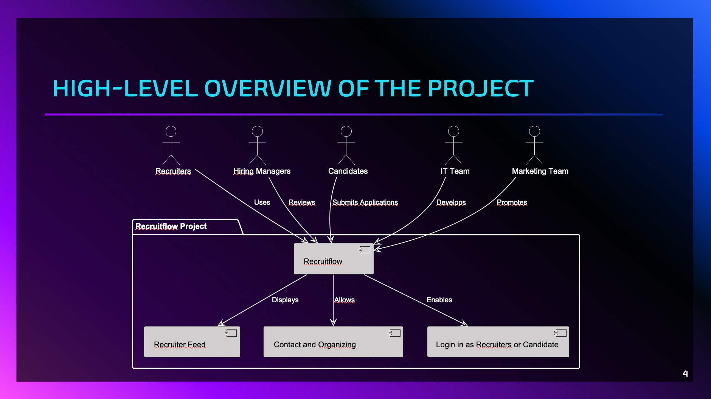

# Project Goal

The goal of this project is to create a platform that connects recruiters with candidates in an intuitive and efficient way. The application enables recruiters to browse through candidate profiles, while candidates can create and manage their own profiles to showcase their skills, experiences, and aspirations.



[website](https://creative-hotteok-0f045b.netlify.app/)
[github](https://github.com/LaLoupiotte/projetSoftware)

## Overview

This project is a web application, built using Vite for fast development and optimized builds. 
The app communicates with a REST API to perform CRUD operations and handle dynamic data.

## Features
- **Frontend**: Built with React for a dynamic and responsive user interface.
- **Backend**: Communicates with a REST API to manage data such as tasks or items.
- **Styling**: Uses Tailwind CSS for modern and customizable styles.
- **Bundling**: Vite ensures fast builds and hot module replacement during development.

## Technologies
- **React**: For building the user interface.
- **Vite**: For efficient development and build tooling.
- **Tailwind CSS**: For styling the application.

## How to Run the Project
**Install dependencies**:
   ```bash
   npm install
   npx vite build
   npm run preview or npm run dev
   ```


